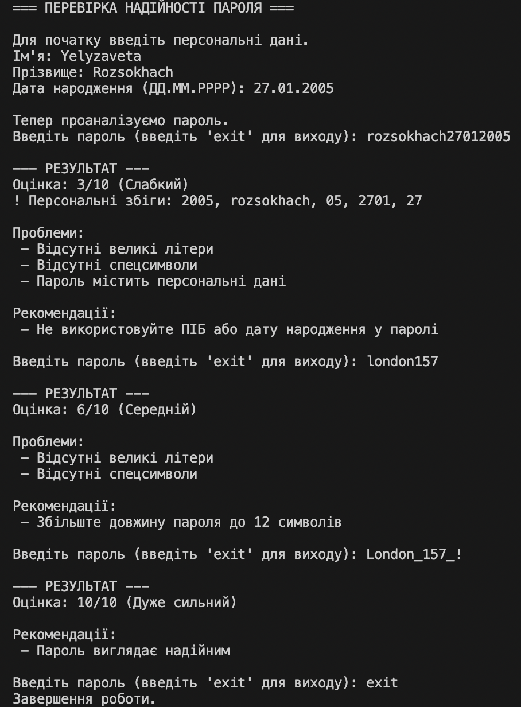

# Лабораторна робота № 1. Аудит власної цифрової безпеки

В даній лабораторній роботі реалізована програма для аналізу безпеки паролів. Програма перевіряє пароль на наявність в ньому персональних даних, оцінює його складність, повідомляє про проблеми та надає рекомендації щодо покращення безпеки паролю.

## Інструкції з запуску програми

1. Переконайтеся, що у вас встановлений Python 3. Якщо Python не встановлений - завантажте його з офіційного сайту: https://www.python.org/downloads/.
2. Переконайтеся, що ви знаходитеся в папці `lab01` в терміналі.
3. Виконайте команду `python main.py` (Windows) або `python3 main.py` (macOS/Linux)

## Приклад використання програми

