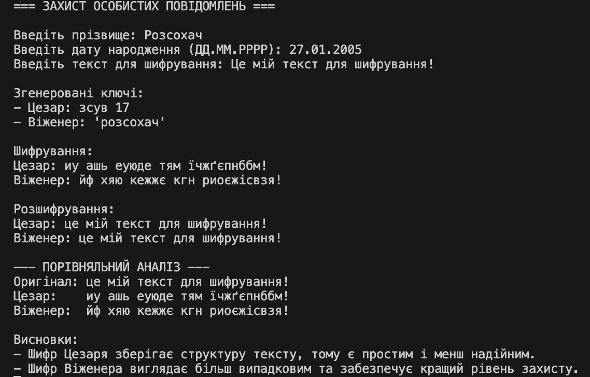

# Лабораторна робота № 2. Захист особистих повідомлень

В даній лабораторній роботі реалізована програма для демонстрації та порівняння двох класичних алгоритмів шифрування - Цезаря та Віженера. Програма використовує персональні дані користувача для вирахування зсуву та ключа для алгоритмів шифрування, виводить зашифрований текст та робить порівняльний аналіз використання обох методів шифрування.

## Інструкції з запуску програми

1. Переконайтеся, що у вас встановлений Python 3. Якщо Python не встановлений - завантажте його з офіційного сайту: https://www.python.org/downloads/.
2. Переконайтеся, що ви знаходитеся в папці `lab02` в терміналі.
3. Запустіть програму на виконання: `python main.py` (Windows) або `python3 main.py` (macOS/Linux)

## Приклад використання програми

