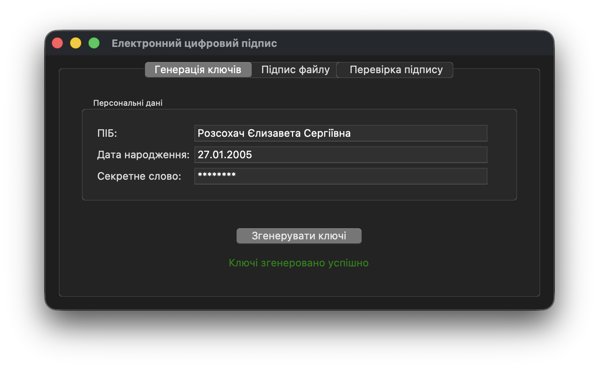
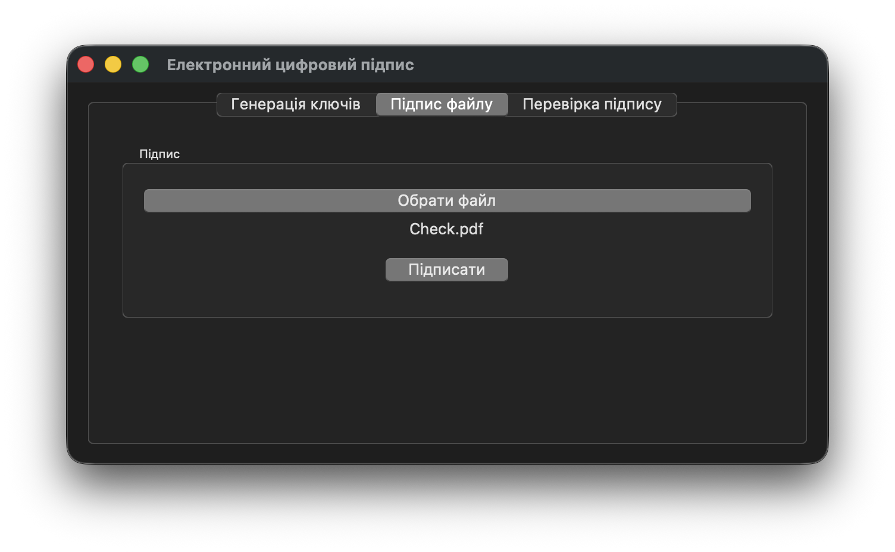
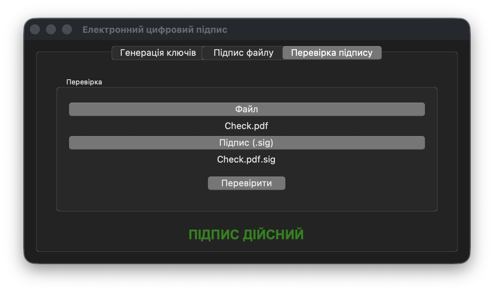
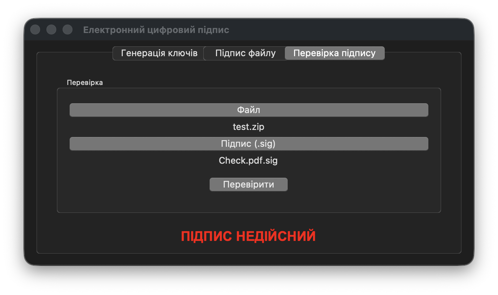
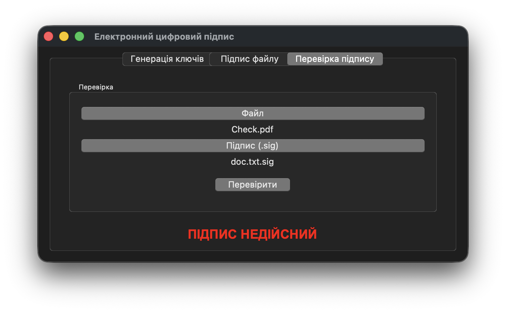

# Лабораторна робота № 4. Особистий цифровий підпис

В даній лабораторній роботі реалізована програма для демонстрації спрощеної системи цифрових підписів з асиметричним шифруванням. Програма генерує приватний та публічний ключі на основі персональних даних користувача, і далі використовує ці ключі для створення особистого цифрового підпису для документа та перевірки його цілісності.

## Інструкції з запуску програми

1. Переконайтеся, що у вас встановлений Python 3. Якщо Python не встановлений - завантажте його з офіційного сайту: https://www.python.org/downloads/.
2. Переконайтеся, що ви знаходитеся в папці `lab04` в терміналі.
3. Запустіть програму на виконання: `python main.py` (Windows) або `python3 main.py` (macOS/Linux)

## Приклад використання програми

Генерація приватного та публічного ключів на основі персональних даних:

Створення особистого цифрового підпису для файлу:

Перевірка цілісності файлу за допомогою згенерованого цифрового підпису:

Перевірка цілісності іншого файлу за допомогою того ж самого цифрового підпису:

Перевірка того ж самого файлу за допомогою іншого цифрового підпису:

