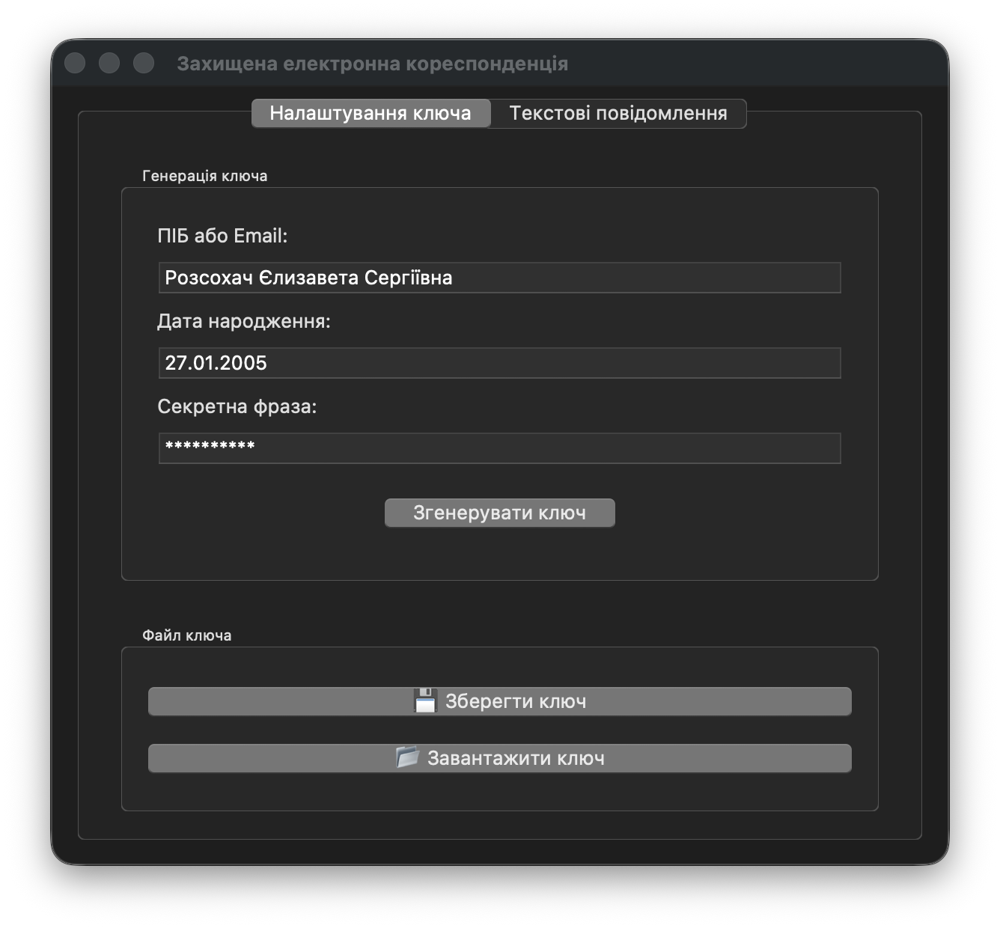
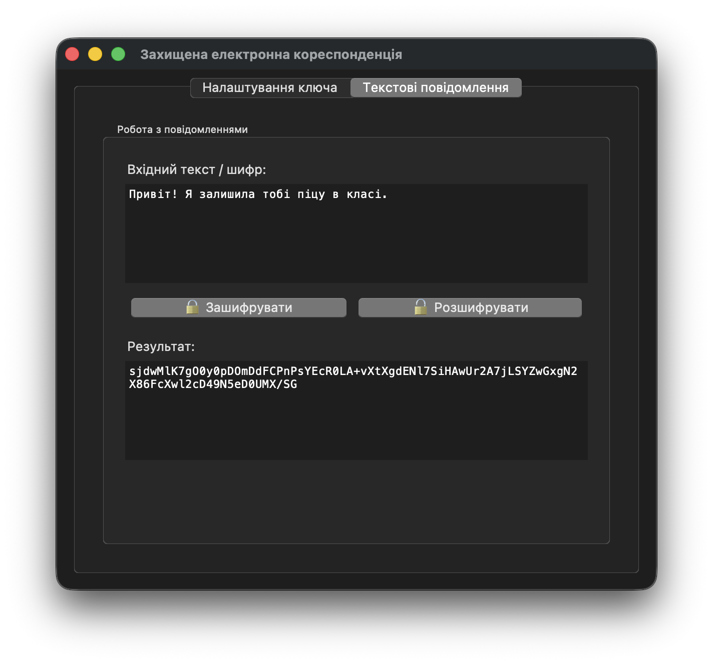
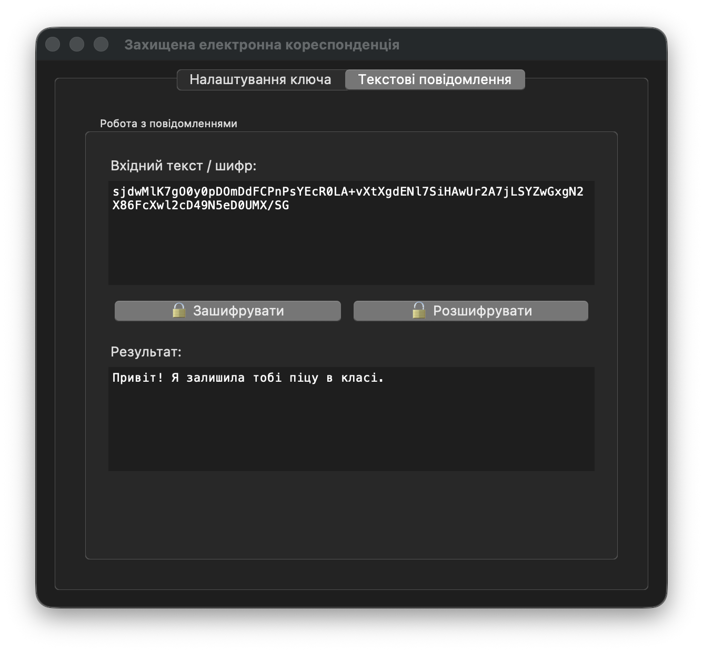

# Лабораторна робота № 5. Захищена електронна пошта

В даній лабораторній роботі реалізована програма для демонстрації принципів захищеної комунікації завдяки використанню простого алгоритму шифрування електронних повідомлень. Програма генерує ключ на основі персональних даних користувача, яким користувач заздалегідь ділиться зі своїм співбесідником. Після цього користувач-відправник може зашифровувати свої текстові повідомлення за допомогою цього ключа, а користувач-отримувач за допомогою цього ключа може розшифровувати отримані повідомлення.

## Інструкції з запуску програми

1. Переконайтеся, що у вас встановлений Python 3. Якщо Python не встановлений - завантажте його з офіційного сайту: https://www.python.org/downloads/.
2. Переконайтеся, що ви знаходитеся в папці `lab05` в терміналі.
3. Запустіть програму на виконання: `python main.py` (Windows) або `python3 main.py` (macOS/Linux)

## Приклад використання програми

Генерація ключа на основі персональних даних:

Шифрування текстового повідомлення за допомогою згенерованого ключа:

Розшифровування текстового повідомлення за допомогою того самого ключа:

Спроба розшифрувати текстове повідомлення за допомогою іншого ключа:

