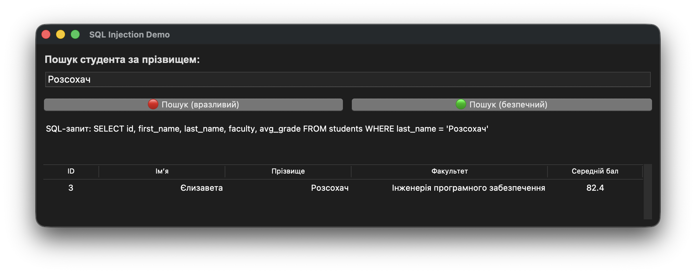
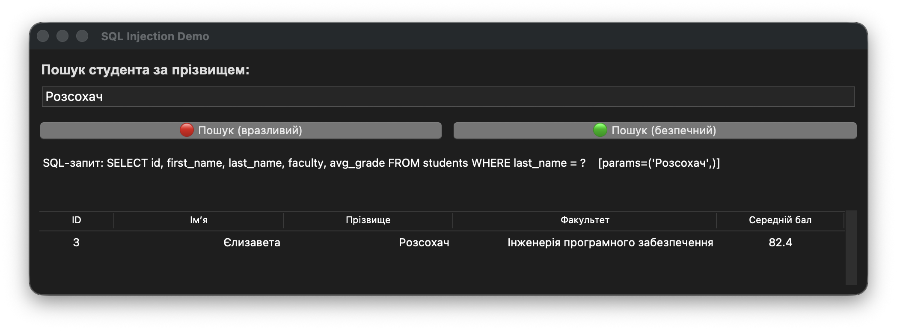
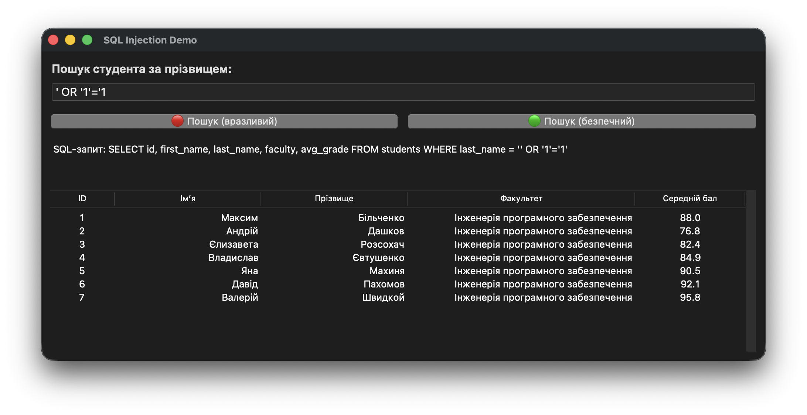
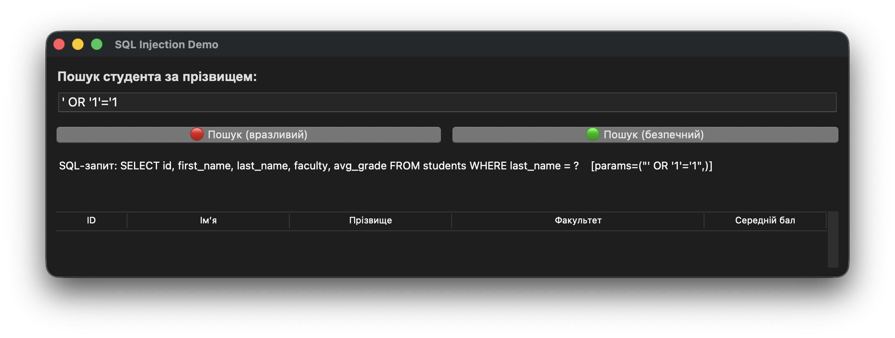

# Лабораторна робота № 6. Етичний хакінг власного застосунку

В даній лабораторній роботі реалізована програма, яка демострує вразливість до SQL-інʼєкцій та методи захисту від них. Програма моделює систему пошуку студентів за прізвищем, і показує, як атака працює на вразливій версії та блокується на захищеній.

## Інструкції з запуску програми

1. Переконайтеся, що у вас встановлений Python 3. Якщо Python не встановлений - завантажте його з офіційного сайту: https://www.python.org/downloads/.
2. Переконайтеся, що ви знаходитеся в папці `lab06` в терміналі.
3. Запустіть програму на виконання: `python main.py` (Windows) або `python3 main.py` (macOS/Linux)

## Приклад використання програми

Приклад нормального використання пошуку на вразливій версії програми:

Приклад нормального використання пошуку на захищеній версії програми:

Приклад SQL-інʼєкції на вразливій версії програми:

Приклад SQL-інʼєкції на захищеній версії програми:

