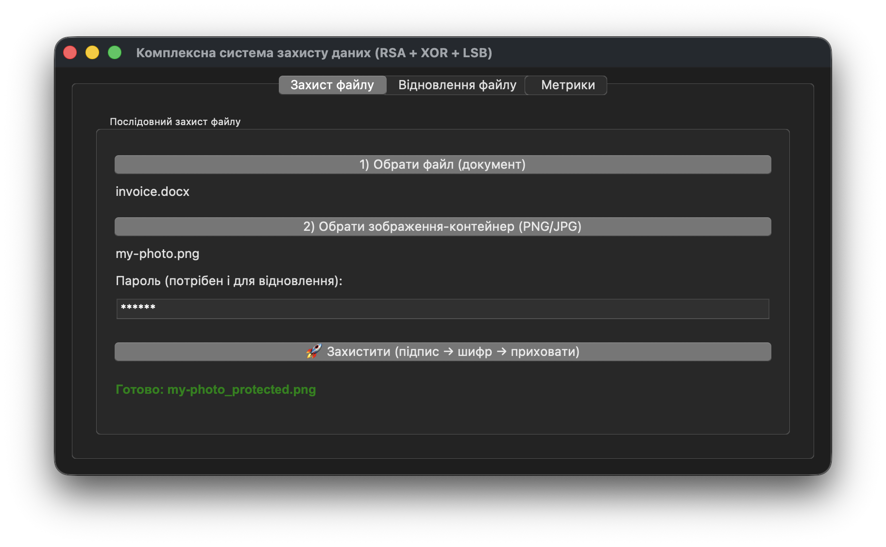
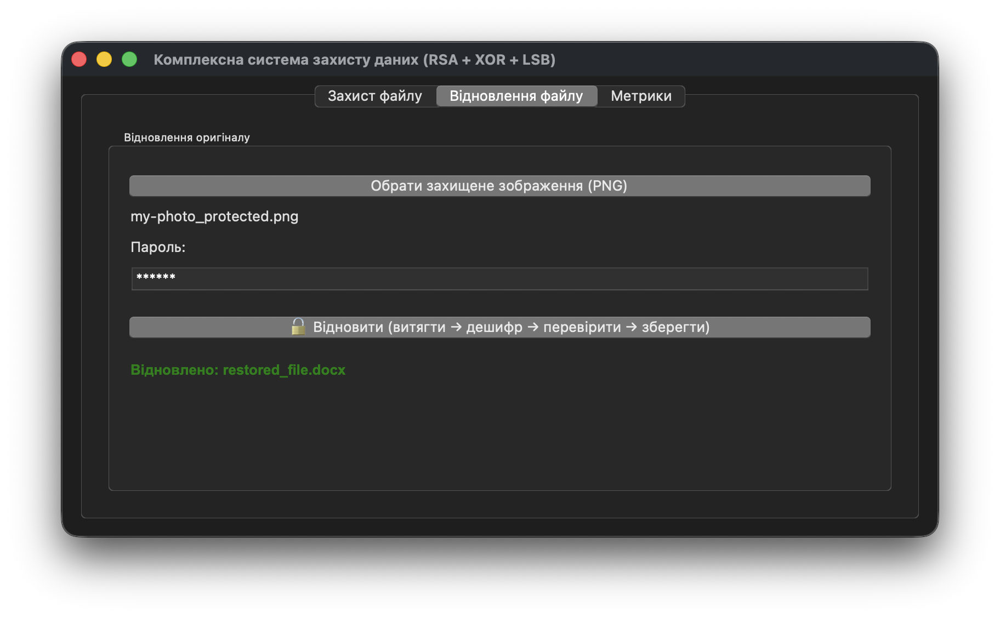
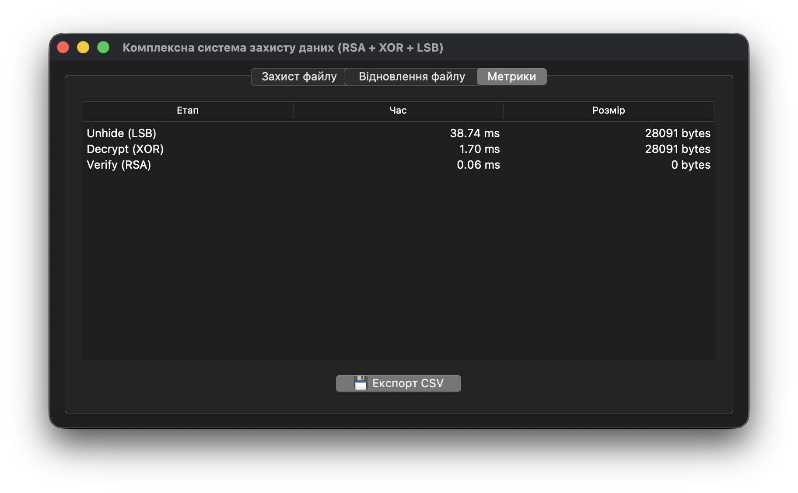

# Лабораторна робота № 7. Комплексний захист особистого проекту

В даній лабораторній роботі реалізована програма комплексної системи захисту інформації, що поєднує декілька методів з попередніх лабораторних робіт. Для захисту даних програма послідовно використовує RSA алгоритм для підпису файлу, симетрично шифрує дані методом XOR та приховує зашифровані дані всередені зображення методом LSB-стеганографії. Відновлення даних відбувається у зворотному порядку.

## Інструкції з запуску програми

1. Переконайтеся, що у вас встановлений Python 3. Якщо Python не встановлений - завантажте його з офіційного сайту: https://www.python.org/downloads/.
2. Переконайтеся, що ви знаходитеся в папці `lab07` в терміналі.
3. Встановіть необхідні залежності: `pip install -r requirements.txt` (Windows) або `pip3 install -r requirements.txt` (macOS/Linux). _Може знадобитися попередньо переключитися у віртуальне середовище._
3. Запустіть програму на виконання: `python main.py` (Windows) або `python3 main.py` (macOS/Linux)

## Приклад використання програми

Захист файлу invoice.docx і приховування зашифрованих даних у зображенні my-photo.png:

Збір метрик по етапу захисту файлу:

Відновлення файлу invoice.docx (нове імʼя - restored_file.docx) зі зображення my-photo_protected.png:

Збір метрик по етапу відновлення файлу:

